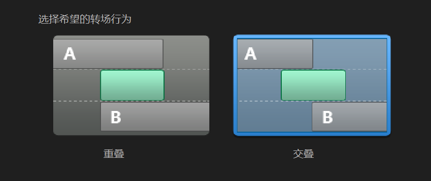

Interest-威力导演-PowerDirector

<!--more-->

## 快捷键 

    Ctrl + Q            导入媒体文件
    Ctrl + T            分割
    ,                   上一帧
    .                   下一帧
    方向键              移动对象
    ctrl+左右方向键     在片段之间移动(片段和全片模式得选择片段)
    shift+左右方向键    在时间线标记之间跳转

## 转场特效总是无法拖动到两个片段中间

是因为转场特效默认为重叠效果

编辑--首选项--常规--默认转场行为--由重叠改为交叠，这样不会影响时间轴长度，也才可
以把转场特效拖动到两个片段中间

